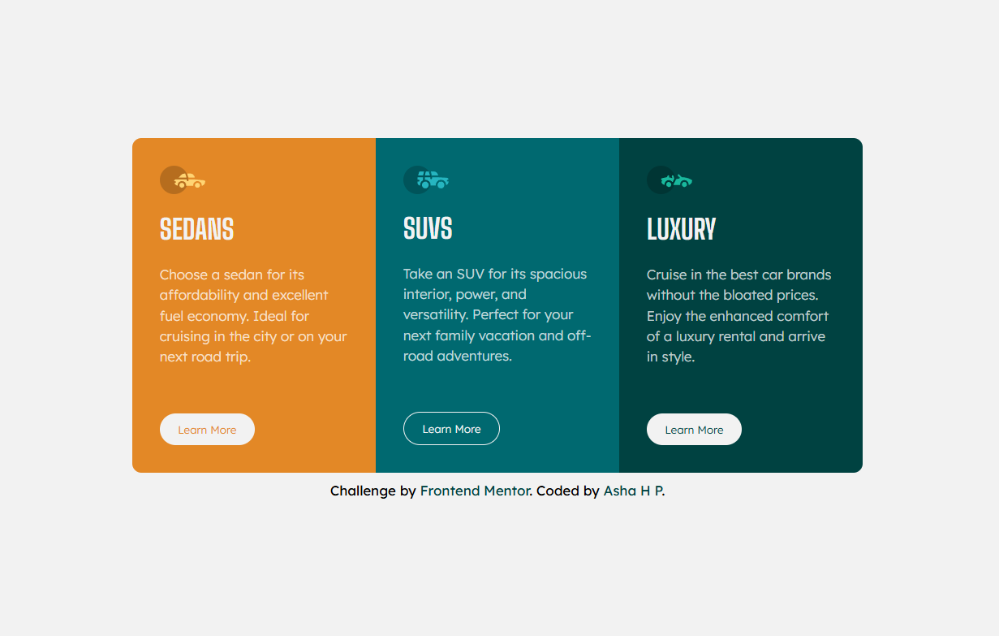

# 3-COLUMN PREVIEW CARD COMPONENT

![Design preview for the [3-COLUMN PREVIEW CARD COMPONENT] challenge](preview.jpg)

## Overview

This is my solution to the **[3-COLUMN PREVIEW CARD COMPONENT]** challenge on [Frontend Mentor](https://www.frontendmentor.io/challenges/3column-preview-card-component-pH92eAR2-).  
The goal was to build a responsive component that matches the provided design using **HTML and CSS**.

---

## Screenshot

---

## Live Demo

🔗 **Live Site:** [View here](https://asha-16.github.io/3-column-preview-card-component/)

---

## Built With

- Semantic **HTML5** markup  
- **CSS3** with Flexbox , Grid and media queries

---

## Author

- Frontend Mentor - [@asha-16](https://www.frontendmentor.io/profile/asha-16)  
- GitHub - [asha-16](https://github.com/asha-16)

---

## Acknowledgments

Thanks to [Frontend Mentor](https://www.frontendmentor.io) for providing this challenge and helping developers improve through real-world projects.
