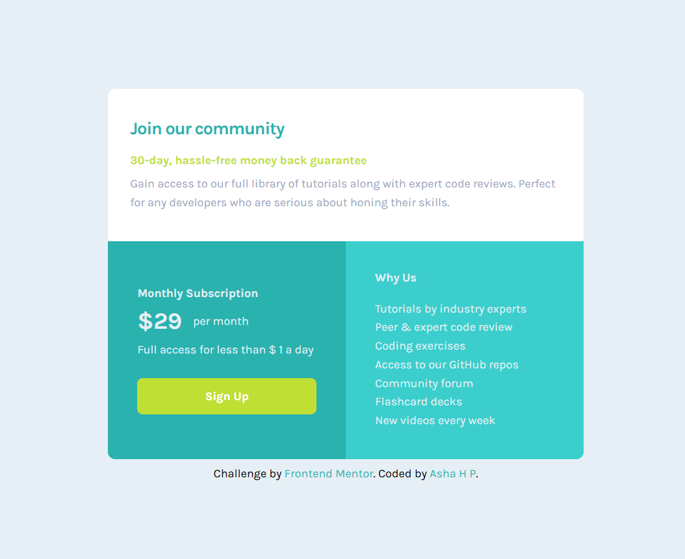

# NFT PREVIEW CARD COMPONENT

![Design preview for the [Project Name] challenge](preview.jpg)

## Overview

This is my solution to the **[NFT PREVIEW CARD COMPONENT]** challenge on [Frontend Mentor](https://www.frontendmentor.io/challenges/nft-preview-card-component-SbdUL_w0U).  
The goal was to build a responsive component that matches the provided design using **HTML and CSS**.

---

## The Challenge

Users should be able to:

- View the layout optimally on different screen sizes  

I aimed to keep the layout clean, accessible, and closely aligned with the design specifications.

---

## Screenshot

---

## Live Demo

🔗 **Live Site:** [View here](https://asha-16.github.io/NFT-preview-card-component/)

---

## Built With

- Semantic **HTML5** markup  
- **CSS3** with Flexbox 
- **Mobile-first workflow**  

---

## Key Learnings

- Better understanding of responsive layouts  
- Writing reusable and organized CSS  
- Handling hover states and visual feedback effectively  

---

## Author

- Frontend Mentor - [@asha-16](https://www.frontendmentor.io/profile/asha-16)  
- GitHub - [asha-16](https://github.com/asha-16)

---

## Acknowledgments

Thanks to [Frontend Mentor](https://www.frontendmentor.io) for providing this challenge and helping developers improve through real-world projects.
